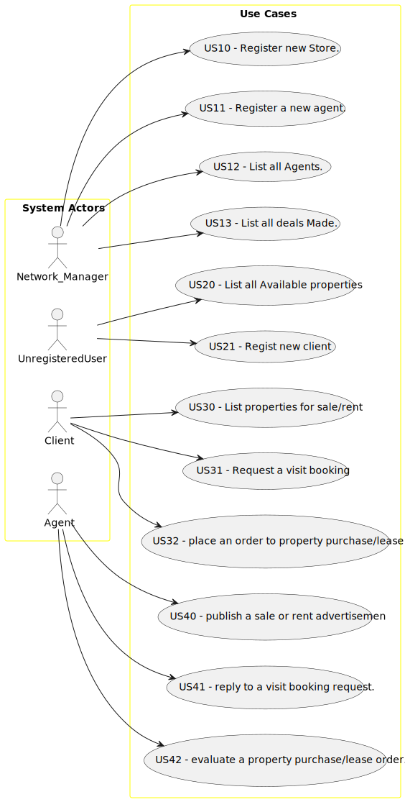

# Use Case Diagram (UCD)

**In the scope of this project, there is a direct relationship of _1 to 1_ between Use Cases (UC) and User Stories (US).
**

However, be aware, this is a pedagogical simplification. On further projects and course units there may also exist _1 to
N **and/or** N to 1_ relationships between UC and US.

**Insert below the Use Case Diagram in a SVG format**

**For each UC/US, it must be provided evidences of applying main activities of the software development process (
requirements, analysis, design, tests and code). Gather those evidences on a separate file for each UC/US and set up a
link as suggested below.**

# Use Cases / User Stories

| UC/US | Description                                                                        |                   
|:------|:-----------------------------------------------------------------------------------|
| US010 | [Manager can create a new Store/branch](../../us001/Readme.md)                     |
| US011 | [Manager can create new agents](../../us001/Readme.md)                             |
| US012 | [Manager can access all agents](../../us001/Readme.md)                             |
| US013 | [Manager can access all deals that are made](../../us001/Readme.md)                |
| US020 | [Unregistered users can see all available properties](../../us001/Readme.md)       |
| US021 | [Unregistered users can create new accounts](../../us001/Readme.md)                |
| US030 | [Clients can access all properties available for sale/rent](../../us001/Readme.md) |
| US031 | [Clients can book a visit to a property](../../us001/Readme.md)                    |
| US032 | [Clients can place orders to buy/lease](../../us001/Readme.md)                     |
| US040 | [Agents can publish sales or ads](../../us001/Readme.md)                           |
| US041 | [Reply to booking requests](../../us001/Readme.md)                                 |
| US042 | [Evaluate client offers](../../us001/Readme.md)                                    |

                                        
