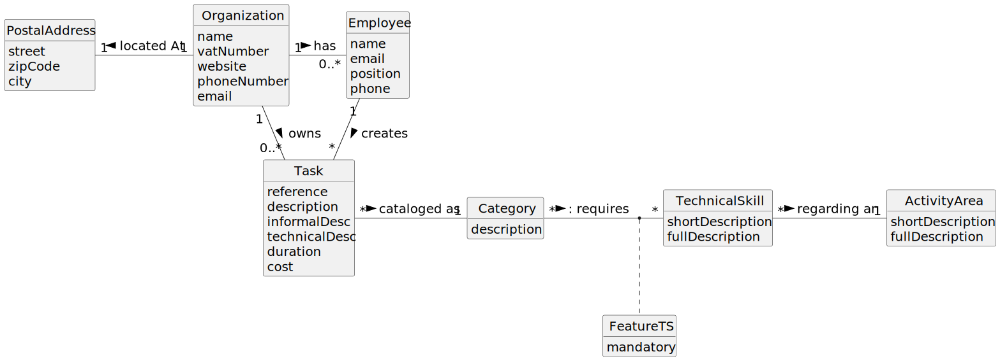

# OO Analysis

The construction process of the domain model is based on the client specifications, especially the nouns (for
_concepts_) and verbs (for _relations_) used.

## Rationale to identify domain conceptual classes

To identify domain conceptual classes, start by making a list of candidate conceptual classes inspired by the list of
categories suggested in the book "Applying UML and Patterns: An Introduction to Object-Oriented Analysis and Design and
Iterative Development".

### _Conceptual Class Category List_

**Business Transactions**

* Property Listing (Sale / Rent)
* Visit Booking
* Purchase/Lease Order

---

**Transaction Line Items**

* Commission Details (Fixed or Percentage-based)

---

**Product/Service related to a Transaction or Transaction Line Item**

* Property (Apartment, House, or Land)

---

**Transaction Records**

* Property Deals (Grouped by Sale or Rent)
* Revenue per Store
* Revenue per Store employee

---  

**Roles of People or Organizations**

* Store Manager
* Client
* Unregistered User
* Agent

---

**Places**

* Store location
* Properties locations

---

**Noteworthy Events**

* Property Listing Approval by Agent
* Visit Scheduling Confirmation
* Purchase/Lease Order Acceptance or Rejection

---

**Physical Objects**

* N/A

---

**Descriptions of Things**

* Property Details (Type, Area, Bedrooms, Bathrooms, Price, Equipment)
* Store Details (Code, Name, Address, Opening/Closing Times)

---

**Catalogs**

* List of Properties
* List of Agents
* List of Transactions (Deals)

---

**Containers**

* Store (Containing Agents and Deals)

---

**Elements of Containers**

* Agents in a Store
* Deals in a Store

---

**(Other) Organizations**

* Dream House (main)

---

**Other (External/Collaborating) Systems**

* N/A

---

**Records of finance, work, contracts, legal matters**

* Property Transactions (Sales, Leases)
* Revenue per Store

---

**Financial Instruments**

* Comission
* Property price

---

**Documents mentioned/used to perform some work/**

* Purchase/Sell Agreements

---

## Rationale to identify associations between conceptual classes

An association is a relationship between instances of objects that indicates a relevant connection and that is worth of
remembering, or it is derivable from the List of Common Associations:

| Concept (A)       |      Association      |       Concept (B) |
|-------------------|:---------------------:|------------------:|
| Property          |     is listed at      |            Branch |
| Property          |    is described by    |  Property Details |
| Property Owner    |         owns          |          Property |
| Property Owner    |        submits        |  Property Listing |
| Real Estate Agent |        manages        |  Property Listing |
| Real Estate Agent |       evaluates       |   Buy/Lease Offer |
| Real Estate Agent |       schedules       |     Visit Booking |
| Client            |        places         |   Buy/Lease Offer |
| Client            |       requests        |     Visit Booking |
| Visit Booking     |  is associated with   |          Property |
| Unregistered User |       registers       |         as Client |
| Enterprise        |          has          |     Stores/Branch |
| Branch            |       contains        | Real Estate Agent |
| Branch            | manages properties in |          Location |
| Location          |      identifies       |          Property |
| SMS Notification  |      is sent for      |     Visit Booking |
| Buy/Lease Offer   |     is related to     |          Property |
| Buy/Lease Offer   |   logs revenue for    |            Branch |
| Catalog           |       contains        |  Property Listing |

## Domain Model

**Do NOT forget to identify concept atributes too.**

**Insert below the Domain Model Diagram in a SVG format**

