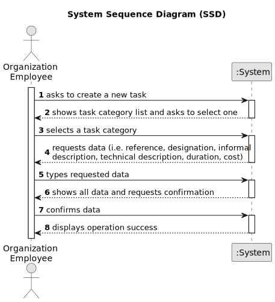

# US010 - Manager creates a new Store

## 1. Requirements Engineering

### 1.1. User Story Description

As a Manager i want to create a new Store, I want to create a new Store in orther to sell/rent houses/apartments/land.

### 1.2. Customer Specifications and Clarifications 

**From the specifications document:**
 
> Each Store is characterized by a code, a designation, an address and opening/close times. 

>	Only Network Managers are capable of creating a new Store.

**From the client clarifications:**

> **Question:** What is a store code?
>
> **Answer:** The store code must be unique and have five alphanumeric characters.

> **Question:** Opening and closing hours are represented in a specific format?
>
> **Answer:** Opening and closing times should be entered in the format hh:mm

### 1.3. Acceptance Criteria

* **AC1:** All required fields must be filled in.
* **AC2:** The Store code must be unique and consist of 5 alphanumeric characters

### 1.4. Found out Dependencies

* There are no dependencies in US010.

### 1.5 Input and Output Data

**Input Data:**

* Typed data:
    * a designation 
    * Address
    * Opening time
    * Closing time

**Output Data:**

* (In)Success of the operation

### 1.6. System Sequence Diagram (SSD)

**_Other alternatives might exist._**

### 1.7 Other Relevant Remarks

N/A