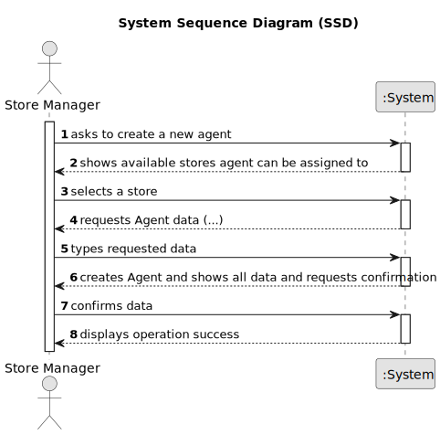

# US011 - As a manager i want to Register a new agent.

## 1. Requirements Engineering

### 1.1. User Story Description

As a Manager i want to register a new Agent, Agent will work in a store

### 1.2. Customer Specifications and Clarifications

**From the specifications document:**

> Each Store is characterized by a code, a designation, an address and opening/close times.
> Agents are characterized by name, the citizen’s card number, the email
> address, the contact telephone number and the agency to which the agent is assigned
> Only Network Managers are capable of creating a new Agent.

**From the client clarifications:**

> **Question:** What is a store code?
>
> **Answer:** The store code must be unique and have five alphanumeric characters.

### 1.3. Acceptance Criteria

* **AC1:** All required fields must be filled in.

### 1.4. Found out Dependencies

* There are no dependencies in US011.

### 1.5 Input and Output Data

**Input Data:**

* Typed data:
* specifying the name, the citizen’s card number, the email
  address, the contact telephone number and the agency to which the agent is assigned
    * card number
    * email
    * address
    * contact
    * agency/store

**Output Data:**

* (In)Success of the operation

### 1.6. System Sequence Diagram (SSD)

**_Other alternatives might exist._**

### 1.7 Other Relevant Remarks

N/A